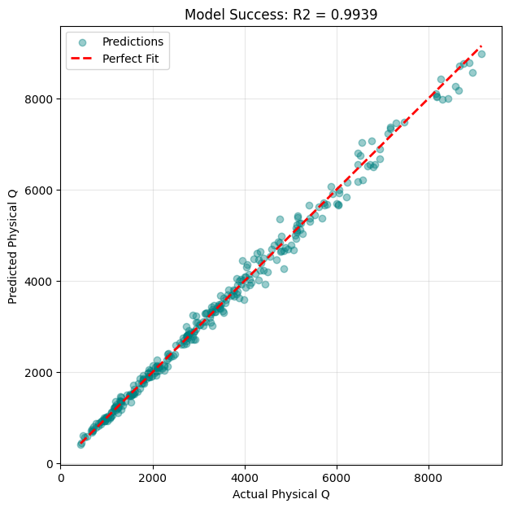
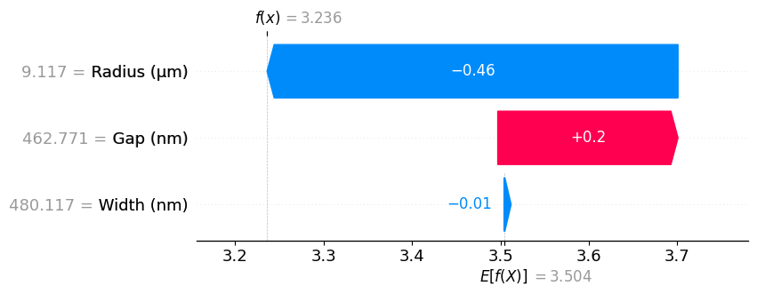

# ML-Accelerated Inverse Design of Photonic Micro-Ring Resonators (MRRs)

## Overview

This repository presents a **Physics-Informed Machine Learning (PIML)** framework for modeling and inverse design of silicon photonic **Micro-Ring Resonators (MRRs)**.

The project demonstrates how **machine learning, when guided by physical laws**, can replace expensive electromagnetic simulations and enable **fast, interpretable, and accurate photonic device design**.

This work bridges **Computer Science (ML + XAI)** and **Nanophotonics**, aligning with research directions in advanced computational photonics (e.g., KAUST).

---

## 🚀 Key Highlights

* **Physics-Informed Feature Engineering**
  Derived features such as Free Spectral Range (FSR), Round-trip Length, and Effective Area improve learning efficiency and physical consistency.

* **High-Fidelity Modeling**

  * R² Score: **0.9939**
  * MAE: **113.26 Q units**
    Demonstrates near-experimental predictive accuracy.

* **Explainable AI (SHAP)**
  Uses SHAP to interpret how physical parameters influence predictions.

* **Inverse Design Capability**
  Enables automated discovery of optimal geometries for target optical performance.

---

## 🛠 Methodology

### 1. Physics-Based Dataset Generation

The dataset is synthetically generated using simplified photonic equations:

* **Geometric Parameters**
    * Radius: $5\mu\text{m} \rightarrow 50\mu\text{m}$
    * Width: $300\text{nm} \rightarrow 800\text{nm}$
    * Gap: $50\text{nm} \rightarrow 500\text{nm}$

* **Physics Modeling**
    * Effective index: $n_{eff}(w)$
    * Coupling: $e^{-g/\alpha}$
    * Loss: bending + scattering


* **Targets**

  * Resonance Wavelength ( \lambda_{res} )
  * Quality Factor ( Q )

---

### 2. Physics-Informed Feature Engineering

We transform raw geometry into physically meaningful representations:

* Round-trip length:
  [
  L = 2\pi R
  ]

* Free Spectral Range:
  [
  FSR = \frac{c}{n_g L}
  ]

* Coupling normalization:
  [
  g_{norm} = \frac{g}{w}
  ]

* Mode confinement:
  [
  A_{eff} = w \cdot h
  ]

---

### 3. Model Architecture

* Model: **Random Forest Regressor**
* Target transformation:
  [
  Q \rightarrow \log_{10}(Q)
  ]

**Rationale:**

* Q spans multiple orders of magnitude
* Log-scaling stabilizes learning and improves generalization

---

## 📊 Results & Interpretability

### 🔷 Model Performance (Parity Plot)

The parity plot demonstrates near-perfect agreement between predicted and true values.



**Metrics:**

* R² Score: **0.9939**
* MAE: **113.26**

---

### 🔷 Feature Importance (Global Explainability)

The model identifies physically meaningful drivers:

* Radius (R) → bending loss
* FSR → cavity resonance behavior
* Gap-related features → coupling strength

This confirms alignment between **ML predictions and optical theory**.

---

### 🔷 SHAP Analysis (Local + Global Explainability)

#### SHAP Summary Plot


#### SHAP Waterfall Plot (Single Prediction)



**Interpretation:**

* Larger radius → increases photon lifetime → higher Q
* Larger gap → weaker coupling → higher Q
* FSR captures resonance structure

This validates that the model is **not a black box**, but **physics-consistent**.

---

## 🔍 Inverse Design Framework

The model can solve the inverse problem:

> “Given a target Q and wavelength, what geometry should we use?”

### Example

**Target:**

* ( Q = 50,000 )
* ( \lambda = 1550nm )

**Optimized Design:**

* Radius: **25.0 µm**
* Width: **500 nm**
* Gap: **200 nm**

This demonstrates **ML-driven photonic design automation**.

---

## ⚙️ Project Structure

```bash
mrr-physics-informed-ml/
│── notebooks/
│── src/
│── outputs/
│── main.py
│── requirements.txt
│── README.md
```

---

## ▶️ How to Run

```bash
pip install -r requirements.txt
python main.py
```

---

## 🧠 Key Insight

Traditional photonics design:

* Slow
* Simulation-heavy
* Hard to optimize

This approach:

* Fast (ML-based)
* Interpretable (XAI)
* Scalable (inverse design ready)

---

## 🎯 Research Relevance

This project demonstrates readiness for:

* Physics-Informed Machine Learning (PIML)
* Photonic inverse design
* Explainable AI in scientific domains

---

## 👨‍💻 Author

**Muhammad Salisu Ibrahim**
BSc. Computer Science — Usmanu Danfodiyo University, Sokoto
CGPA: 4.45 / 5.0

**Focus Areas:**

* Machine Learning
* Explainable AI (XAI)
* Scientific Computing

**Project Experience:**

* Heart Disease Prediction using ML + XAI
* Photonic Device Modeling (this project)

---

## 📌 Future Work

* Integrate real photonic datasets (e.g., Lumerical simulations)
* Extend to deep learning (Physics-Informed Neural Networks)
* Build full inverse design optimization pipeline

---

## ⭐ Conclusion

This project demonstrates that:

> Machine Learning, when guided by physics and interpreted with XAI, can accelerate discovery in nanophotonics.

---
